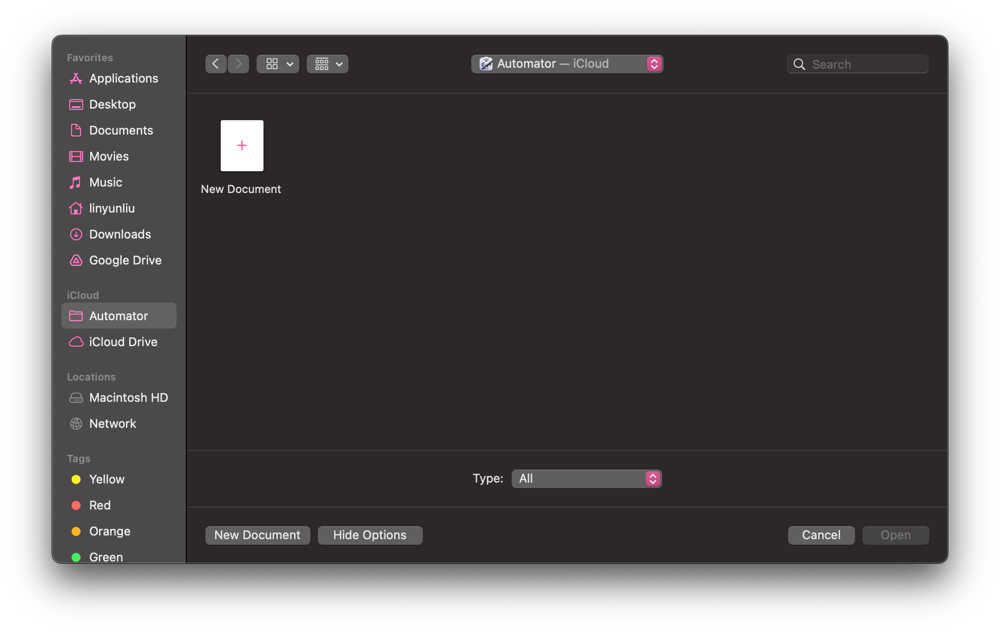
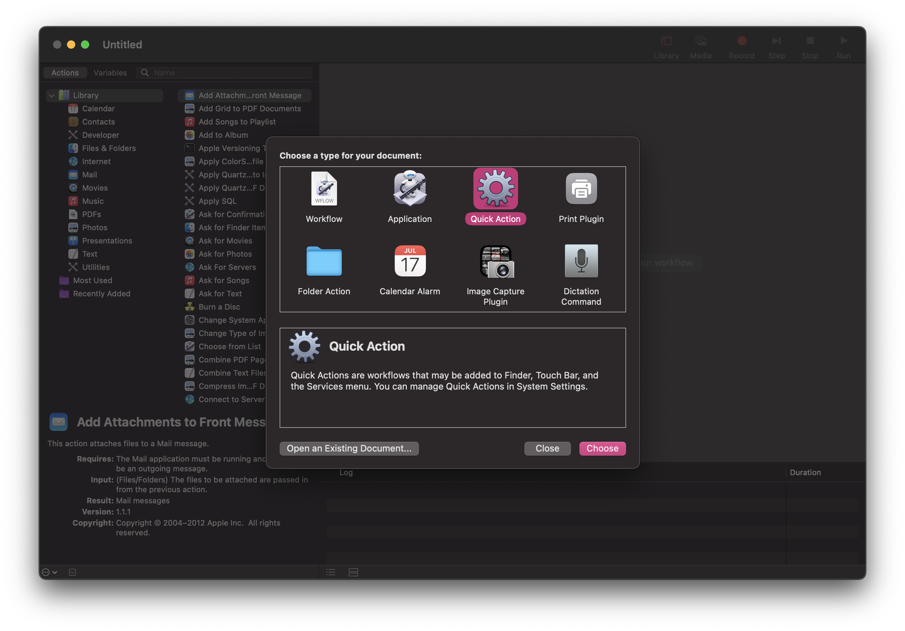
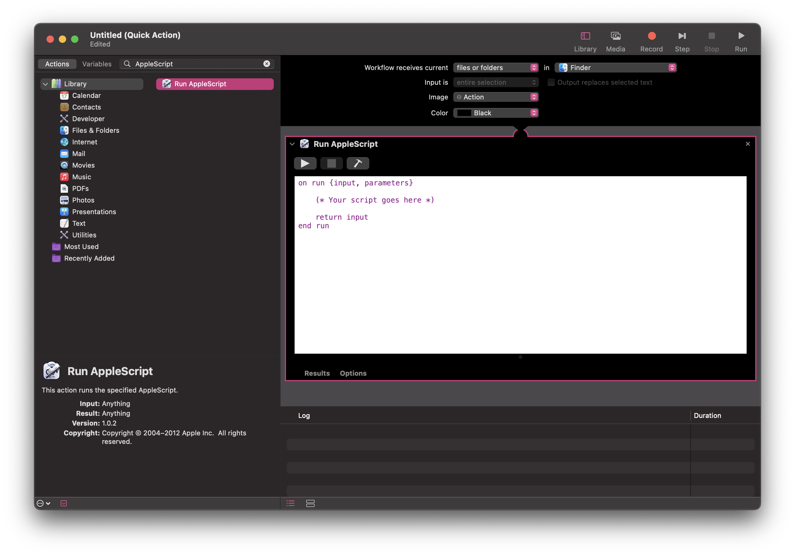
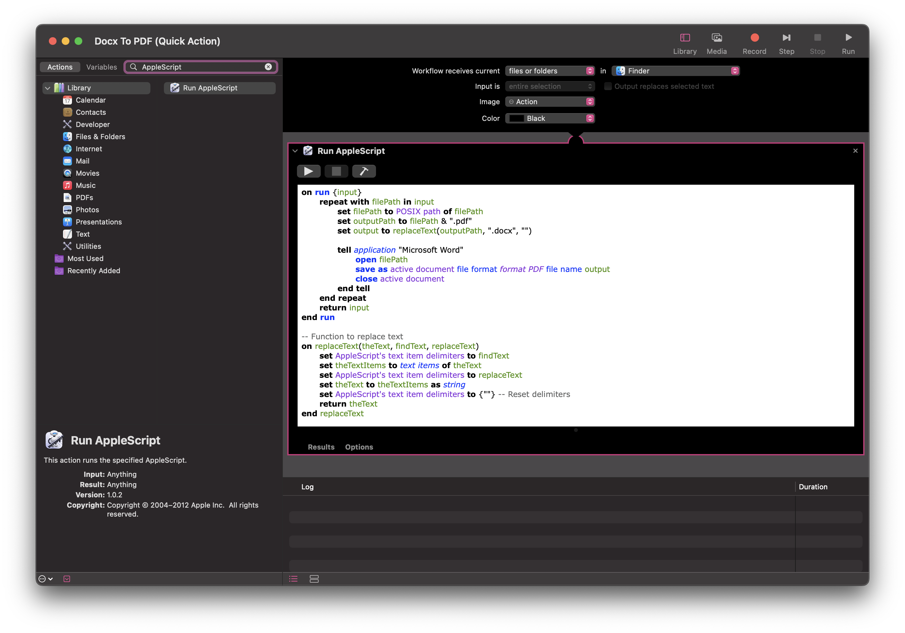

## Introduction
If you're a Mac user, have you ever found it inconvenient that there's no quick shortcut to export DOCX files to PDF? Imagine being able to select one or more Word documents, right-click, and instantly see an option to export them to PDF - no need to open each file individually. Just two clicks, and you're done. Simple, fast, and efficient. Wouldn’t that be a game-changer?

## Tools we will need
### Apple Automator
Apple Automator is a built-in macOS application that allows users to automate repetitive tasks without writing code (however, you can write code if you want to). It provides a visual, drag-and-drop interface where you can build workflows by connecting pre-made actions — much like snapping together digital Lego blocks. Using Automator, you can create a Quick Action that integrates seamlessly into the macOS right-click menu. In this case, the Quick Action will take one or more .docx files as input and use AppleScript to convert them to PDF, leveraging Microsoft Word’s built-in export engine for high-fidelity results (explained below).
### Licensed Microsoft Word
A licensed copy of Microsoft Word is essential when you need to convert `.docx` files to `PDF` with full formatting fidelity or automate tasks like batch exports, scripting, or integration with tools AppleScript. These methods rely on Word’s built-in export engine, which accurately preserves complex layouts, fonts, tables, and other advanced document features that alternatives often misinterpret. Without a valid license, Word runs in limited or read-only mode, disabling key functions like saving, exporting, or responding to automation. To enable full functionality, you must install Microsoft Word and sign in with a valid Microsoft 365 or standalone license.

## Step 1: Open Automator & Create New Document 
Open Automator on your Mac, it’s typically found in the "Other" folder within Launchpad. Once the application launches, click the "New Document" button to get started. You’ll then be prompted to choose the type of automation you want to create.

## Step 2:  Create a Quick Action
In the new document window, select “Quick Action” as the type of automation. This will allow you to create a custom workflow that can be accessed directly from the Finder’s right-click menu

## Step 3: Edit Workflow
As shown below, set the workflow to receive `files or folders` in `Finder`. You can also choose a custom icon to make your Quick Action easier to recognize


## Step 4: Add AppleScript
In the search bar at the top left of the Automator window, type **“AppleScript”**, then drag the **“Run AppleScript”** action into the workflow panel on the right. This allows you to write a script that will take one or more `.docx` files as input and export them as PDFs.

## Step 5: Write some AppleScript
When this script runs, it loops through each selected files. Then, for each file, it tells Microsoft Word to open the document, export it as a PDF using Word’s built-in export feature, and close the document afterward. 

Here is the completed code for you to copy and paste
```applescript
on run {input}
	repeat with filePath in input
		set filePath to POSIX path of filePath
		set outputPath to filePath & ".pdf"
		set output to replaceText(outputPath, ".docx", "")
		
		tell application "Microsoft Word"
			open filePath
			save as active document file format format PDF file name output
			close active document
		end tell
	end repeat
	return input
end run

-- Function to replace text
on replaceText(theText, findText, replaceText)
	set AppleScript's text item delimiters to findText
	set theTextItems to text items of theText
	set AppleScript's text item delimiters to replaceText
	set theText to theTextItems as string
	set AppleScript's text item delimiters to {""} -- Reset delimiters
	return theText
end replaceText
```

## Step 6: Save this Quick Action
Save your Quick Action and give it a name like **“Docx to PDF”**. This will create a workflow file located at:  `/Users/your-username/Library/Services/`.  If you ever want to remove the Quick Action, you can simply delete the workflow file from that directory.

Once your Quick Action is saved, you can use it by doing the following:
1. **Right-click** on one or more `.docx` files in Finder
2. Hover over **“Quick Actions”** in the context menu
3. Click on **your custom action** (e.g., _“Docx to PDF”_) to run it

## In conclusion
If everything is set up correctly, you now have an incredibly convenient Quick Action that can convert a single .docx file or an entire batch into high-fidelity PDFs with just a 2~3 clicks. 

## GitHub
We’ve included the AppleScript used in this tutorial in our [GitHub repository](https://github.com/thealcyonite/DocxToPdfAutomation). Feel free to use it as-is, modify it to suit your needs, or improve upon it however you like.
